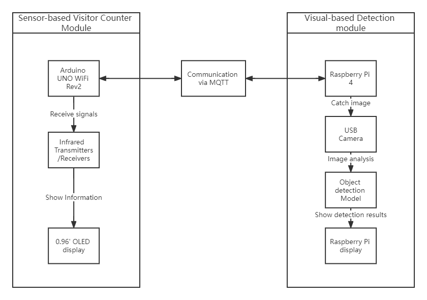

# CASA-0022-Hybrid-visitor-counter-system

This is a dissertation project for CASA0022, an intelligent visitor counter system based on sensor data and visual information. Firstly, a two-way visitor counter is devised for our CE classroom. The visitor counter is based on two IR LED transmitter sensors and two IR receivers to detect the human movements of visitors in the CE classroom. With IR transmitters and receivers, this visitor counter can distinguish whether the visitor is moving in or out according to the order of the output signal. This module is based on Arduino UNO Wi-Fi with various sensors and IoT techniques. Secondly, an image detection module is designed to detect the visitor's position in the CE classroom. This module is based on an object detection model, pre-trained on the MS COCO dataset, getting the bounding boxes of the visitors in the image. The classroom study space is manually divided into three parts, sofa area, desk area, and equipment area. The area that overlaps the most with the person detection box will be considered the activity area where the visitor is located. This module is based on Python running on a Raspberry Pi 4. Lastly, in order to communicate between two modules, the MQTT is used to publish and subscribe messages between Arduino and Raspberry Pi 4. Besides, an OLED screen is used to visualise the number and location of visitors in each divided study area and the total number of visitors in the CE classroom as a digital information dashboard. The visual detection results are shown on a Raspberry Pi monitor.



## Get Started

### Sensor-based Visitor Counter Module

1. Build your prototype of visitor counter module following the circuit below:


2. Update your Wi-Fi and MQTT information in `visitor-counter-receiver/arduino_secrets.h`
3. Upload Arduino code from the folder `visitor-counter-transmitter` and `visitor-counter-receiver`.

### visual-based Detection Module

1. Install 64 bit OS on Raspberry Pi 4:
   - Installing the latest version of  [Raspberry Pi Imager](https://www.raspberrypi.org/software/) ;
   - Click on **Choose OS,** then select **Raspberry Pi OS (other)* ;
   - Select either **Raspberry Pi OS (64-bit)** ;
   - Click on **Choose Storage** and select your attached microSD card (typically named ‘Generic Storage Device Media’);
   - Click on **Write** to write the OS image to the microSD card. Note that this will erase any existing data on it;

2. Install necessary Python packages, run this command in the terminal:

   ```
   pip install -r requirements.txt
   pip install paho-mqtt
   ```

3. Update your Wi-Fi and MQTT information in `detection/user_secret.py`

4. run the python script in terminal:

   ``` 
   python detection/MQTT_detection.py
   ```

## Workflow

The work flow chart of the Hybrid-visitor-counter-system is shown as following flow chart:


## Media resource

The folder `media` contains abundant media resources of the Hybrid Visitor Counter System deployed in the real-world.

## Reference

1. https://www.makeuseof.com/install-64-bit-version-of-raspberry-pi-os/
2. https://github.com/ultralytics/yolov5
